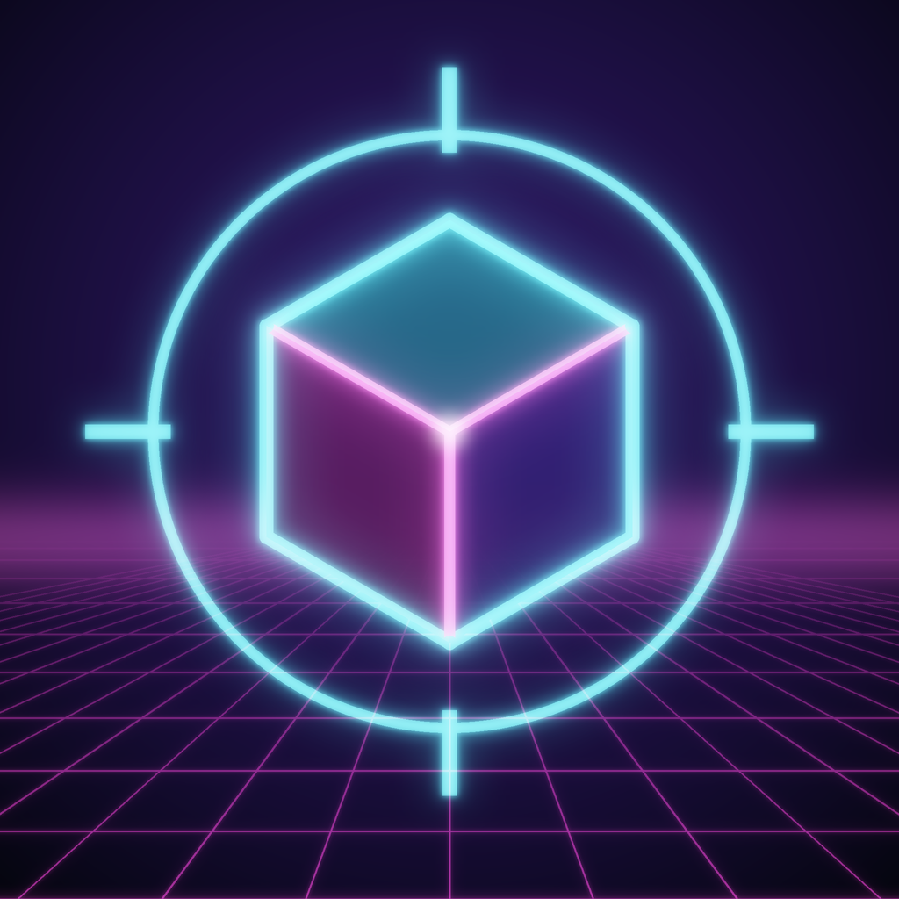

# Кубострел

Неоновый шутер от первого лица для iPhone на 2–6 игроков. Играть можно по Wi-Fi, через интернет (ZeroTier) или одному против ботов. Сделан на Unreal Engine 5.8 и C++, без готовых ассетов: арены, материалы, интерфейс и звуки создаются кодом.

**Как поставить на iPhone: [INSTALL.md](INSTALL.md).**

## Что есть в игре

- Две арены: «Неон-Куб» и «Бастионы», с подъёмами, укрытиями и прыжковыми площадками.
- Четыре оружия: автомат, дробовик, рельса и ракетница. Их и аптечки подбирают на арене.
- Боты трёх уровней сложности. Они заполняют свободные места и уступают их людям.
- Сенсорное управление: левая половина экрана для бега, правая для поворота, большая кнопка для стрельбы. Есть помощь в прицеливании и автоогонь, их можно выключить в настройках.
- Матч до нужного числа фрагов или до конца времени, таблица игроков, лента убийств.
- Настройки: чувствительность, угол обзора, громкость, качество графики, счётчик FPS.

## Как устроен проект

Проект Unreal состоит из нескольких папок, и в этом всё обычно:

| Папка | Что внутри |
|---|---|
| `Kubostrel.uproject` | Описание проекта: версия движка, модуль с кодом, плагины. Двойной щелчок открывает его в редакторе. |
| `Source/` | Код игры на C++. `*.Target.cs` и `Kubostrel.Build.cs` говорят сборщику Unreal (UBT), что и как компилировать. |
| `Config/` | Настройки движка в `.ini`: стартовая карта, графика, сеть, параметры iOS и подписи. |
| `Content/` | Ассеты. Здесь только скрипт на Python, который создаёт четыре материала при первом открытии проекта. |
| `Build/IOS/` | Иконка приложения. |
| `Tools/` | Помощники для `install_iphone.command`. |

Почти вся игра собрана из обычных классов Unreal:

- **`KSGameInstance`** живёт всё время работы приложения: настройки, создание и поиск игры, подключение.
- **`KSGameMode`** есть только на сервере и ведёт матч: появление игроков, фраги, боты, конец матча.
- **`KSGameState`** и **`KSPlayerState`** хранят то, что должны видеть все: счёт, время, ленту убийств. Движок сам рассылает их изменения по сети (репликация).
- **`KSCharacter`** это робот игрока: движение, оружие, здоровье. Выстрел считается сразу на телефоне стрелка, а сервер проверяет попадание, поэтому стрельба ощущается мгновенной даже с задержкой сети.
- **`KSPlayerController`** превращает касания (или мышь и клавиатуру) в движение и стрельбу; **`KSHUD`** рисует всё поверх матча.
- **`KSArenaData`** описывает арены блоками, **`KSArenaBuilder`** строит их из простых фигур со светом, небом и туманом. Сервер передаёт только номер арены, и каждый телефон строит её сам.
- **`KSBotController`** ходит по графу точек арены и целится с задержкой и разбросом, как человек.
- **`KSLanDiscovery`** ищет игры в сети: шлёт маленький UDP-пакет на каждый адрес подсети, хост отвечает.
- **`KSAudio`** синтезирует все звуки при запуске, **`KSFXManager`** показывает вспышки, трассеры и взрывы.

Сеть устроена как «listen server»: телефон, который создал игру, одновременно и сервер, и игрок. Отдельный сервер не нужен.

Числа оружия лежат в таблице в `Source/Kubostrel/KSTypes.cpp`, арены в `Source/Kubostrel/KSArenaData.cpp`. Поменяй и пересобери скриптом установки.

## Поиграть на Mac

iPhone и Apple ID для этого не нужны, хватит Xcode 26.1.1 и Unreal Engine 5.8 (шаги 1 и 2 из [INSTALL.md](INSTALL.md)). Открой Терминал и запусти:

```
cd ~/Downloads/kubostrel-main && bash play_mac.command
```

Скрипт скомпилирует игру и откроет её в окне. Первый запуск долгий: Unreal готовит шейдеры для Mac. Управление: WASD и мышь, пробел для прыжка, 1–4 для оружия, R для перезарядки, Tab для таблицы, Esc для меню. Чтобы выйти, закрой окно игры. Если macOS спросит, разрешить ли входящие подключения, нажми «Разрешить»: это нужно, чтобы создавать игры по сети.

То же самое можно сделать в редакторе. В Xcode 26.1.1 открой **Settings → Locations** и в поле **Command Line Tools** выбери Xcode 26.1.1: редактор берёт компилятор шейдеров оттуда. Потом открой `Kubostrel.uproject` в Unreal Editor двойным щелчком или из Epic Games Launcher (**Запустить** у версии 5.8, потом **Обзор**). Если редактор спросит, собрать ли модули, ответь «Да». Нажми **⋮** рядом с кнопкой **Play** и выбери **Standalone Game**. Обычный **Play** тоже работает, но в нём Esc останавливает игру, а не открывает меню.
